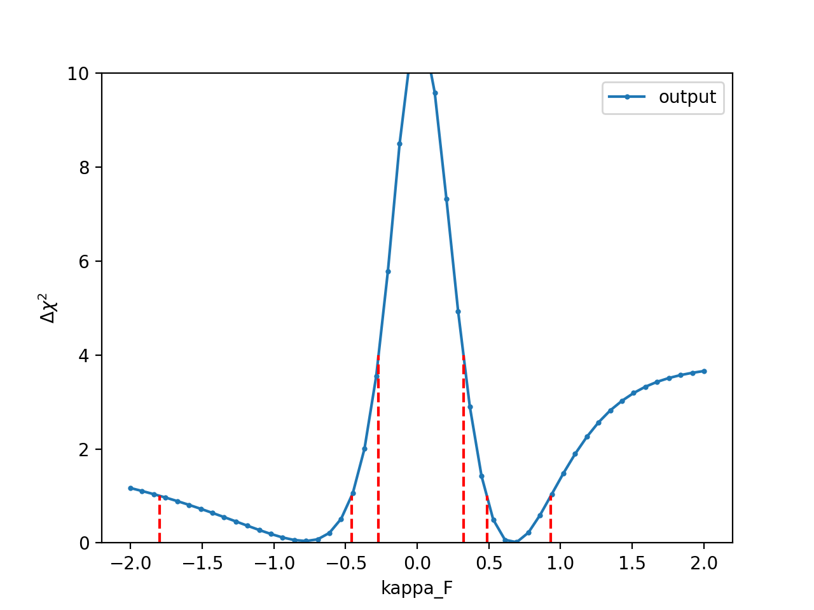
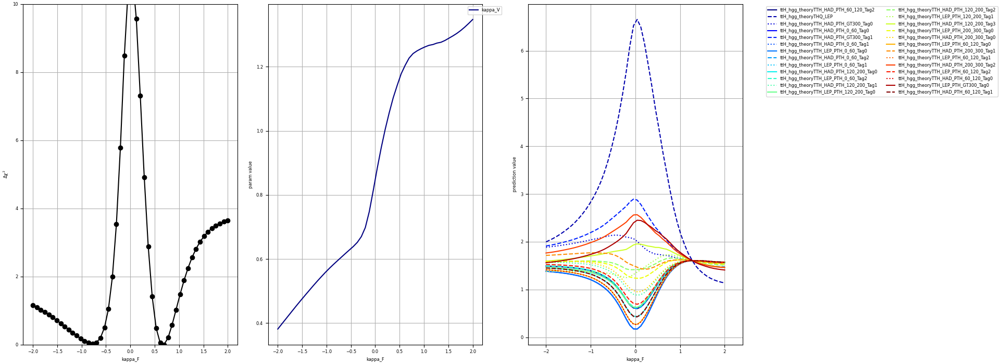

# EFT-Fitter

## Run the fit(s)

The main tool is the `runFit.py` script. This will run a fit of the pois, followed by a profiled and a fixed scan of each poi in the range given. Note that the default values in the fixed scans will be fixed to those given in the `params` file unless you add the option `--setParamsToNominal` in which case they will instead be fixed to the global maximum likelihood estimates. 

An example run is 

```python runFit.py --inputs inputs.HIG_19_015.ttH_HIG_19_015 --pois params.tth_hgg_kVkF --functions functions.tth_hgg_kVkF --output tth_hgg_fits_kVkF  --npoints 50```

The output is a `.pkl` file with the results of the $\Delta \chi^{2}$ vs the poi values from each scan. In this case its called `resultstth_hgg_fits_kVkF_observed.pkl`. You can take a look at the results, for example to pull out the profiled scan of kappa_F, with 

   - ```python utils/pickle2text.py resultstth_hgg_fits_kVkF_observed.pkl kappa_F output.txt``` 

   - ``` python utils/overlay_scans.py show output.txt```

This will produce the following plot 



Or you can plot either POI (along with the function values, and profiled parameter values) directly from the results via 

```
python utils/poi_profile.py resultstth_hgg_fits_kVkF_observed.pkl kappa_F
```

This will produce the following plot 



## Options 
```
python runFit.py --help                                                                                            [15:44:30]
Usage: runFit.py [options]

Options:
  -h, --help            show this help message and exit
  --pois=POIS           Name of json file storing pois
  --output=OUTPUTSTR    Identifier string for output results
  --functions=FUNCTIONS
                        Name of json file storing functions
  --inputs=INPUTS       Comma separated list of input files
  --theory_uncert=THEORY_UNCERTS
                        config for theory uncertainties
  --doAsimov            Do asimov fit (i.e. set all best-fit to nominal)
  --doReset             Reset poi values each step in profiled scan
  --doFlip              Start scan from max val of poi
  --doLinear            Also run the scan using linear terms of functions
                        (defined in --functions) -- only appropriate for EFT
                        models with SM+linear+BSM terms)
  --setParamsToNominal  Set nominal values of the POIs to those at the global
                        minimum
```                    

**To-do** : add proper description of `runFit.py` 
