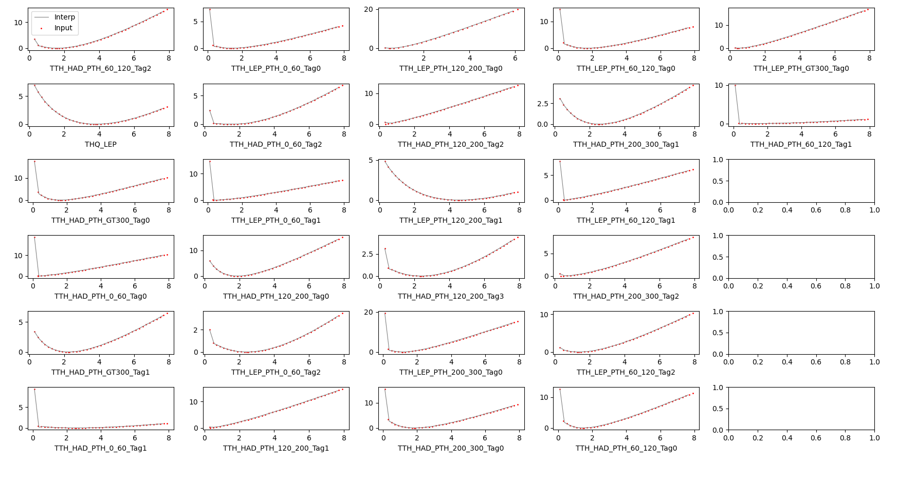
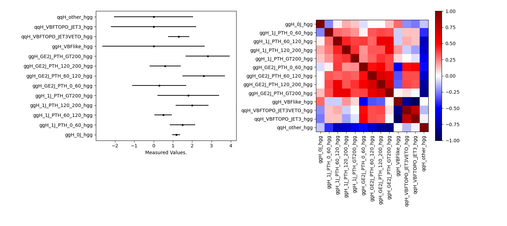
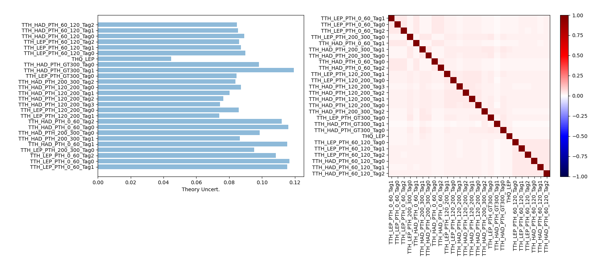

#  A bunch of helpful scripts to plot whats going on 

## `checkinputs.py`

check your inputs with this script

`python checkinputs.py module.input`

  -  if the input is a data (eg likelhood scan or best fits) it will plot those
  -  if the input is a theory uncertainty file, it will plot the uncertainties and correlations

For example, in the inputs folder, there is an example of the "likelihood scan" type under `inputs/ttH_hgg_19_015/ttH_HIG_19_015.py` such that running 

```python utils/checkinputs.py inputs.ttH_hgg_19_015.ttH_HIG_19_015```

results in the following 



Instead, there is an example of a STXS H->gg inputs as a simple best-fit and correlations under `inputs/HIG-18-029.py` such that running 

```python utils/checkinputs.py inputs.HIG-18-029```

results in 



Finally, if instead you have a theory uncertainties input, such as the one in `inputs/ttH_hgg_19_015/ttH_hgg_theory_uncerts.py`

You can run 

```python utils/checkinputs.py inputs.ttH_hgg_19_015.ttH_hgg_theory_uncerts```

and get 



## `pickle2text.py`

cript to covert piclked results into a simple txt file (can then be used with `overlay_scans.py`

`python pickle2text.py results.pkl parameter outfilename`

## `root2text.py`

A script to take a ROOT (higgsCombineX.root) file of a likelihood scan and turn into plain text

`python root2text.py input.root outname [brach_names]`

  - By default, all branches will be plotted, select only parameters you want using branch_names options - brn1 brnn2 brn3 ...


## `overlay_scans.py`

Very quick tool to plot likelihood scans from txt files - i.e those produced from above (1D only)

`python overlay_scans.py outname input1.txt [input2.txt input3.txt....]`

  -  set outname=`show` to just show the results rather than save as pdf/png.
  -  overlay as many scans  as you like. The script will plot whichever parameter it finds though

